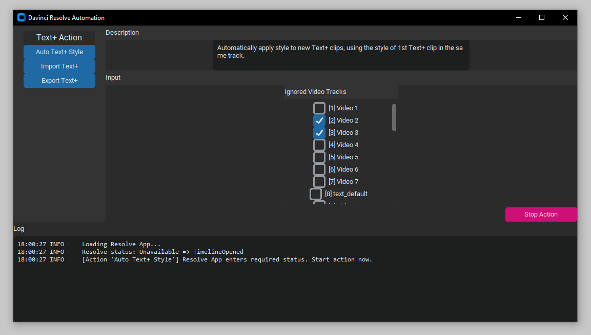

# automate-davinci-resolve
- [x] Feature: Auto apply Text+ style for each track
- [x] Feature: Import Text+ from .srt subtitle file
- [x] Feature: Export Text+ to .srt subtitle file
- [ ] Improve responsiveness (async)
- [ ] Improve GUI look

## How to run
1. Enable external scripting in Davinci Resolve Studio (Preferences > Generael > External scripting using > Local)
2. Make sure `RESOLVE_SCRIPT_API` and `RESOLVE_SCRIPT_LIB` in `pyproject.toml` are pointing to correct path (depends on your Davinci Resolve installation)
3. run `install_requirements.bat`
4. run `start_script_win.bat` (for Windows)

## How it looks

## Reference
- Davinci Resolve README.txt (win default path: `C:\ProgramData\Blackmagic Design\DaVinci Resolve\Support\Developer\Scripting\README.txt`)
- [Davinci_Resolve_18_Reference_Manual.pdf](https://documents.blackmagicdesign.com/UserManuals/DaVinci_Resolve_18_Reference_Manual.pdf)
- [Fusion8_Scripting_Guide.pdf](https://documents.blackmagicdesign.com/UserManuals/Fusion8_Scripting_Guide.pdf)
